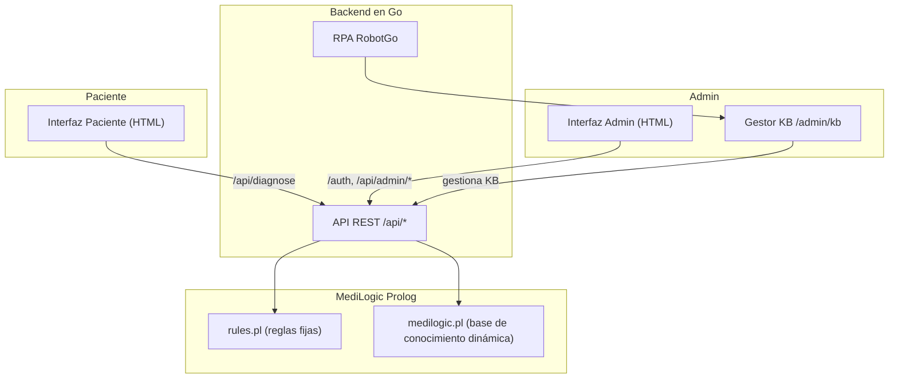

# Manual Técnico MediLogic

## Introducción
Este documento constituye el manual técnico del sistema MediLogic. Incluye la arquitectura del sistema, las herramientas utilizadas, la estructura del archivo `.pl`, el flujo de interacción entre los módulos, las reglas lógicas implementadas en Prolog y su justificación, además de las decisiones de diseño tomadas. También se incluye la configuración realizada para el módulo de **RPA** (automatización).

---

## 1. Arquitectura del Sistema

El sistema MediLogic se basa en una arquitectura híbrida:

- **Backend en Go**: gestiona la API REST, coordina la comunicación con el motor Prolog y expone los resultados en el frontend.  
- **Motor Prolog (Ichiban Prolog)**: procesa las reglas de diagnóstico y urgencia definidas en rules.pl, complementadas con la base de conocimiento dinámica medilogic.pl.  
- **Frontend web (HTML)**: interfaces separadas para paciente y administrador, donde se ingresan síntomas o se gestionan enfermedades y medicamentos.  
- **Módulo de RPA (RobotGo)**: automatiza el llenado de formularios del panel de administrador a partir de archivos externos.  

### Diagrama de arquitectura

---

## 2. Herramientas Utilizadas
- **Go**: para el backend, integración con Prolog y módulo RPA.  
- **Ichiban Prolog**: motor Prolog embebido.  
- **HTML**: frontend.  
- **RobotGo**: librería en Go para automatización de mouse/teclado.  

---

## 3. Estructura del archivo `.pl`

El sistema utiliza dos archivos principales en Prolog:

1. **rules.pl** (reglas fijas):
   - Normalización de severidad.  
   - Cálculo de afinidad (`afinidad/3`).  
   - Reglas de urgencia clínica (`urgencia/1`).  
   - Lógica de medicamentos seguros (`medicamento_seguro/2`).  

2. **medilogic.pl** (base dinámica, auto-generada desde `/admin/kb`):
   - `sintoma/1`  
   - `enfermedad/4` y `descripcion_enf/2`  
   - `enf_sintoma/2`  
   - `medicamento/1`, `trata/2`, `contraindicado/2`, `enf_contra_medicamento/2`  

---

## 4. Flujo de Interacción entre los Módulos
1. El administrador gestiona la KB desde `/admin/kb`.  
2. Los cambios se guardan en `assets/kb/medilogic.pl`.  
3. El paciente accede a paciente, selecciona síntomas, alergias y crónicas.  
4. El frontend envía estos datos a `/api/diagnose`.  
5. El backend en Go aserta hechos en Prolog y consulta las reglas.  
6. Prolog devuelve resultados (afinidad, urgencia, medicamentos).  
7. El backend responde en JSON y el frontend lo muestra en tabla y gráficas.  

---

## 5. Reglas en Prolog 
- **Normalización de severidad**: leve=1, moderado=2, severo=3 → cuantificar síntomas cualitativos.  
- **Afinidad (`afinidad/3`)**: mide coincidencia de síntomas con cada enfermedad → evaluar consistencia clínica.  
- **Urgencia (`urgencia/1`)**: disnea o dolor_pecho → “Atención prioritaria” → refleja banderas rojas.  
- **Medicamentos seguros (`medicamento_seguro/2`)**: excluye bloqueados por alergias, crónicas o enfermedad → seguridad del paciente primero.  

---

## 6. Decisiones de Diseño
- Separar reglas fijas (`rules.pl`) de **hechos dinámicos** (`medilogic.pl`).  
- Usar Go por facilidad de integrar Prolog y RobotGo.  
- Implementar RPA para automatizar carga de KB.  
- Incorporar banderas rojas para reflejar triage clínico.  

---

## 7. Configuración del Robot (RPA)
El módulo de RPA se implementó en Go con RobotGo. Configuración realizada:  

- **Coordenadas** de mouse para cada campo del formulario.  
- **Tiempos de espera** entre clicks y escritura para simular interacción humana.  
- Lectura de archivo `rpa.txt` con instrucciones de enfermedades, síntomas y medicamentos a registrar.  
- **Reportes (`rpa_report.txt`)** para validar ejecución.  

Esto asegura que la automatización cargue de forma confiable la información en el sistema web, demostrando la integración de RPA.

---

## 8. Video de RPA

https://drive.google.com/file/d/1Kdgu-EB-l5jKwPWMQv5Hg3ZYpSegB5Ch/view?usp=drive_link 

---
## Conclusiones
MediLogic integra un motor lógico en Prolog con un backend en Go y un frontend web. El sistema representa razonamientos básicos de diagnóstico médico a nivel académico, y la inclusión del RPA demuestra la posibilidad de automatizar flujos administrativos.  
La arquitectura modular facilita la mantenibilidad y extensión futura.
