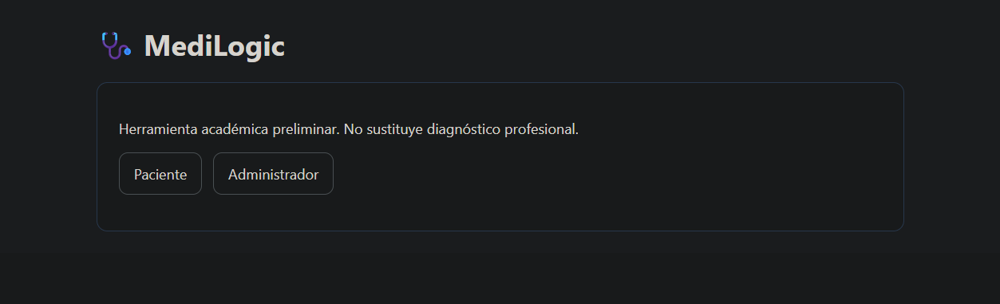
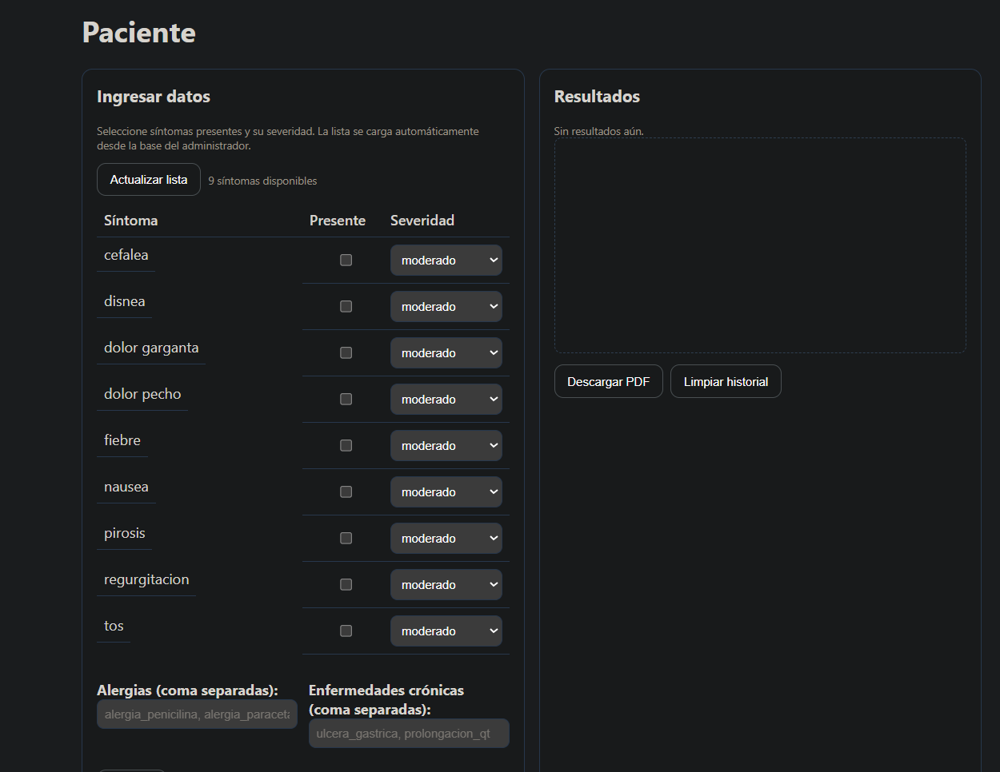
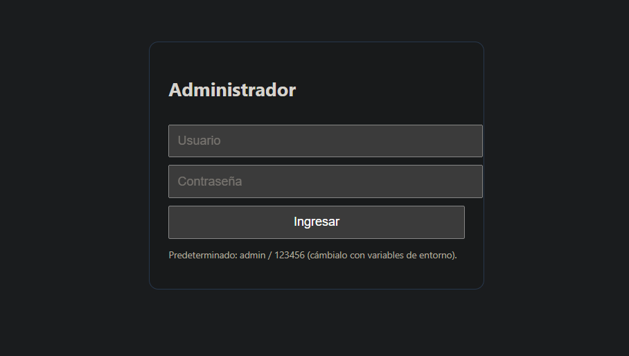

# Manual de Usuario — MediLogic

## Introducción
El sistema MediLogic cuenta con una interfaz web que permite la interacción de dos tipos de usuarios:  
- **Paciente**: persona que ingresa síntomas, alergias y enfermedades crónicas para obtener un diagnóstico preliminar.  
- **Administrador**: encargado de gestionar la base de conocimiento, añadiendo síntomas, enfermedades y medicamentos.  

Este manual describe las funcionalidades principales del frontend y cómo utilizarlas.

---

## 1. Página de Inicio
Al abrir el sistema, se muestra la **página de inicio**, desde la cual se puede acceder a:  
- **Paciente** → botón que dirige a la interfaz de diagnóstico.  
- **Administrador** → botón que dirige al login de administración.

---

## 2. Módulo Paciente
La sección de Paciente permite al usuario ingresar datos clínicos para recibir un diagnóstico preliminar.

### Funcionalidades:
1. **Selección de síntomas**  
   - Cada síntoma puede marcarse con un nivel de severidad (leve, moderado, severo).  
2. **Registro de alergias**  
   - El usuario puede ingresar alergias conocidas (ej. alergia_paracetamol).  
3. **Registro de enfermedades crónicas**  
   - Permite indicar condiciones crónicas como asma, prolongación QT, etc.  
4. **Generación de diagnóstico**  
   - El sistema calcula afinidad (%) con enfermedades registradas, indica nivel de urgencia y sugiere medicamentos seguros.

---

## 3. Módulo Administrador
El administrador gestiona la base de conocimiento desde `/admin/kb`.

### Funcionalidades:
1. **Gestión de síntomas**  
   - Se pueden añadir, editar o eliminar síntomas mediante su ID y etiqueta.  
2. **Gestión de enfermedades**  
   - Se registran enfermedades con ID, nombre, sistema (ej. respiratorio), tipo (ej. viral), descripción.  
   - Se asocian síntomas y medicamentos contraindicados.  
3. **Gestión de medicamentos**  
   - Se definen medicamentos con su ID, etiqueta, enfermedades que tratan y condiciones/alergias que los contraindican.  
4. **Guardado de cambios**  
   - Los cambios se almacenan automáticamente en `assets/kb/medilogic.pl`, que es leído por el motor lógico.

---

## 4. Resultados esperados en el Módulo Paciente
Tras ingresar síntomas, alergias y crónicas, el sistema muestra:  
- **Enfermedad sospechada** con porcentaje de afinidad.  
- **Medicamento sugerido**, si no está bloqueado.  
- **Nivel de urgencia clínica** (Observación, Consulta recomendada, Atención prioritaria).

---

## Conclusiones
El frontend de MediLogic facilita tanto la interacción del paciente como la gestión del administrador. El flujo está diseñado para ser simple y claro: el paciente solo necesita seleccionar síntomas y condiciones, mientras que el administrador mantiene actualizada la base de conocimiento para mejorar los resultados del diagnóstico.
